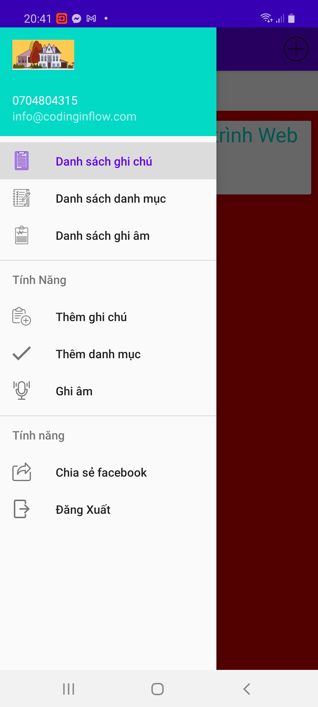
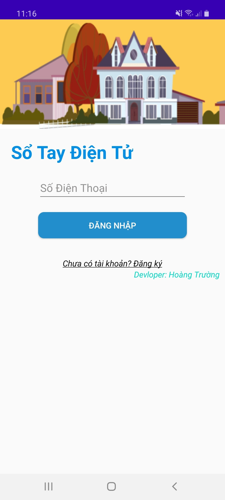
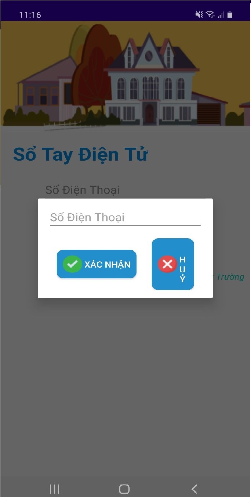
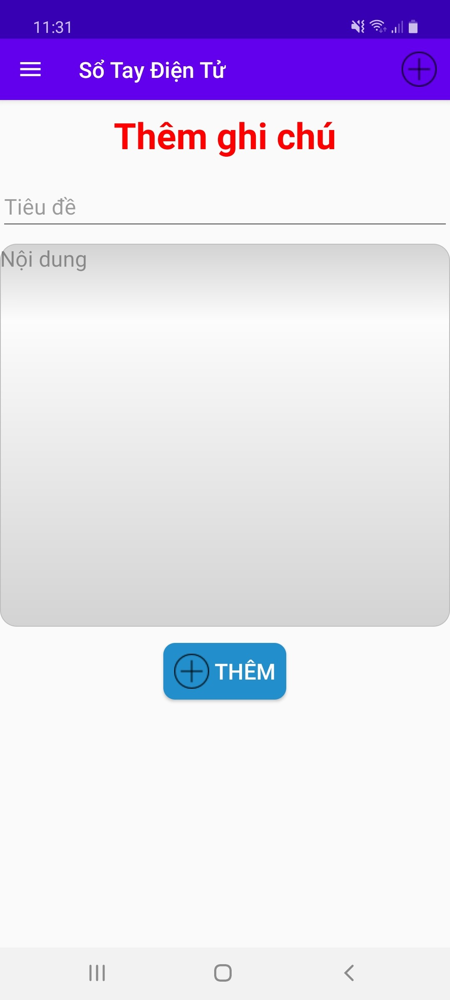
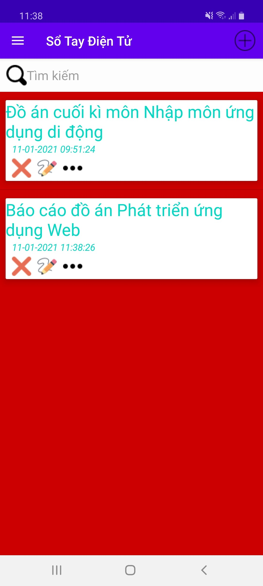
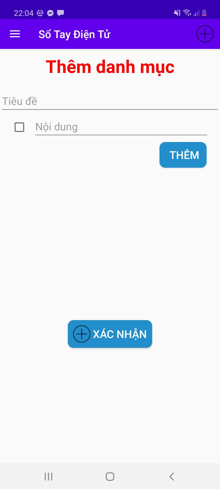
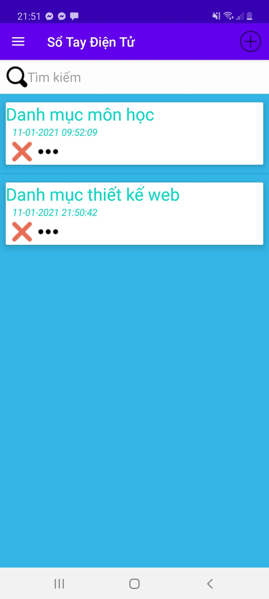
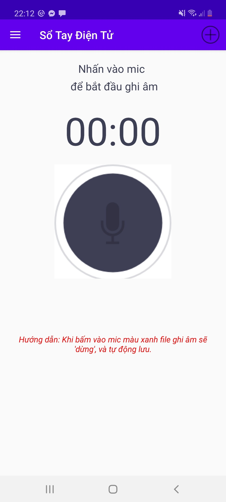
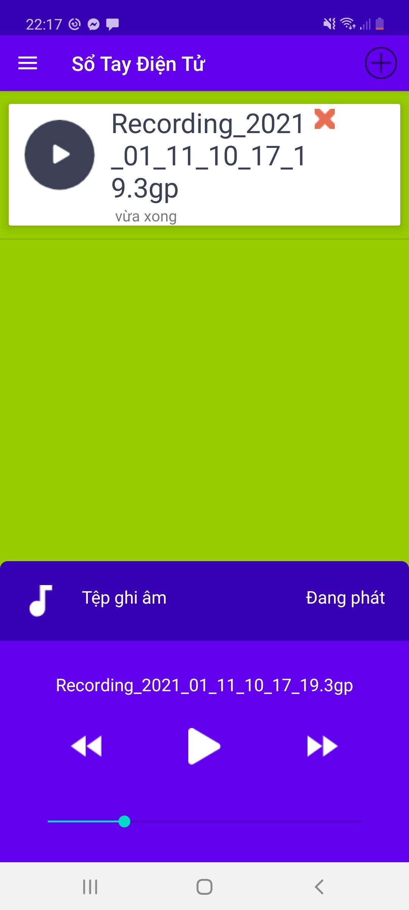

<h1>Ứng dụng Smart Note - sổ tay điện tử</h1>

Ứng dụng Smart Note giúp mọi người ghi chú mọi lúc mọi nơi, hữu ích cho mục địch quản lý kế hoạch, lịch trình, thời gian biểu, ghi âm cũng như sắp xếp công việc hàng ngày

<h2>
1. Chức năng</h2>
    

- Đăng nhập, đăng kí

    
    
	

    
 
- Thêm ghi chú

    
	

    
 
- Danh sách ghi chú

    
	

     
- Thêm danh mục

    
	

	

    
- Danh sách danh mục

	
	

	

     
- Thêm ghi âm

	

	

     
- Danh sách ghi âm

    
	

<h2>2. Yêu cầu thiết bị</h2>
    
- Android studio: 4.0 

    
- Gradle: 4.1

    
- Min sdk: 19

    
- Target sdk: 26

<h2>3. Thư viện và công nghệ: </h2>
    
- Language: Java

    
- Database: SQLite

<h2>4. Tác giả: </h2>
    
- Nguyễn Hoàng Trường - 17521185@gm.uit.edu.vn

<h2>5. Link download: </h2>
    <a href="https://install.appcenter.ms/users/hoangtruong1808-gmail.com/apps/smart-note/distribution_groups/test">https://install.appcenter.ms/users/hoangtruong1808-gmail.com/apps/smart-note/distribution_groups/test</a>
<h2>6. Giấy phép: </h2>
	<code> Copyright 2014
Licensed under the Apache License, Version 2.0 (the "License");
you may not use this file except in compliance with the License.
You may obtain a copy of the License at
http://www.apache.org/licenses/LICENSE-2.0 
Unless required by applicable law or agreed to in writing, software
distributed under the License is distributed on an "AS IS" BASIS,
WITHOUT WARRANTIES OR CONDITIONS OF ANY KIND, either express or implied.
See the License for the specific language governing permissions and
limitations under the License. 
	</code>
=======
limitations under the License. </code>

